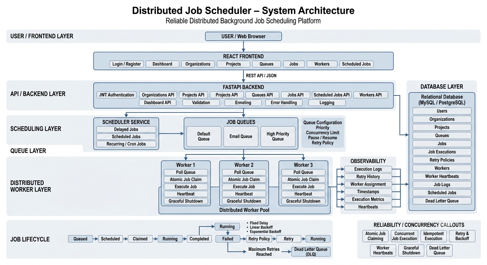
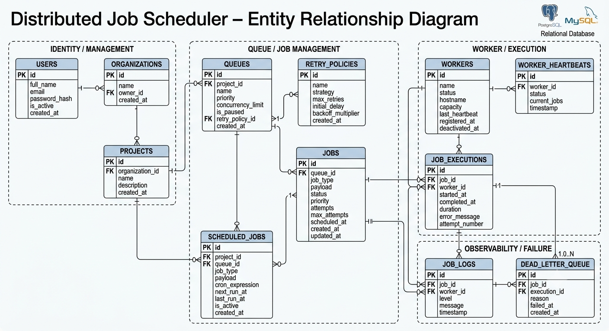

# Distributed Job Scheduler

A production-inspired distributed background job scheduling platform designed to reliably create, schedule, execute, monitor, and retry asynchronous jobs across multiple workers.

The project focuses on **backend engineering, relational database design, job reliability, concurrency, REST API design, observability, and a responsive management dashboard**.

---

## 📌 Project Overview

The Distributed Job Scheduler provides a centralized platform for managing background jobs through projects and queues.

Users can:

* Register and authenticate securely.
* Create and manage organizations.
* Create projects inside organizations.
* Create multiple queues for each project.
* Configure queue priority and concurrency.
* Create immediate and scheduled jobs.
* Create batch jobs.
* Monitor job status and attempts.
* Retry failed jobs.
* Monitor distributed workers.
* Pause and resume queues.
* View queue statistics.
* Manage recurring scheduled jobs.
* Monitor overall system health through a web dashboard.

The backend exposes REST APIs using FastAPI, while the frontend provides a responsive dashboard for interacting with the scheduler.

---

## ✨ Features

### Authentication

* User registration
* User login
* JWT-based authentication
* Password hashing
* Protected backend resources
* Logout support on frontend

### Organization & Project Management

* Create organizations
* View organizations
* Create projects
* Associate projects with organizations
* Manage project-owned queues

### Queue Management

* Create queues
* Configure queue priority
* Configure concurrency limits
* Pause queues
* Resume queues
* View queue statistics
* Track queued, running, completed, failed, and dead jobs

### Job Management

Supports the core job lifecycle:

```text
QUEUED
   ↓
SCHEDULED
   ↓
CLAIMED
   ↓
RUNNING
   ↓
COMPLETED
```

Failure handling:

```text
RUNNING
   ↓
FAILED
   ↓
Retry
   ↓
RUNNING
```

After the configured retry limit:

```text
FAILED
   ↓
DEAD
```

Additional capabilities include:

* Immediate jobs
* Scheduled jobs
* Batch jobs
* Job deletion
* Failed-job retry
* Job status monitoring
* Attempt tracking
* Job payloads

### Worker Management

* Worker registration
* Worker status monitoring
* Worker heartbeat
* Worker health checks
* Worker deactivation
* Worker capacity/status monitoring

### Scheduled Jobs

* Create recurring jobs
* View scheduled jobs
* Pause scheduled jobs
* Resume scheduled jobs
* Delete scheduled jobs
* Process recurring jobs

### Dashboard

The frontend dashboard provides:

* Organization statistics
* Project statistics
* Queue statistics
* Job statistics
* Worker statistics
* Queue management
* Job explorer
* Worker monitoring
* Scheduled-job management
* System health indicators

---

## 🏗️ System Architecture

The platform follows a modular client-server architecture.



### Main Components

```text
                    ┌──────────────────────┐
                    │      Web Browser      │
                    │   React Dashboard     │
                    └──────────┬───────────┘
                               │
                               │ REST / HTTP
                               ▼
                    ┌──────────────────────┐
                    │      FastAPI API      │
                    │ Authentication        │
                    │ Organizations         │
                    │ Projects              │
                    │ Queues                │
                    │ Jobs                  │
                    │ Workers               │
                    │ Scheduled Jobs        │
                    └──────────┬───────────┘
                               │
                               ▼
                    ┌──────────────────────┐
                    │   SQLAlchemy ORM      │
                    └──────────┬───────────┘
                               │
                               ▼
                    ┌──────────────────────┐
                    │    Relational DB      │
                    │       MySQL            │
                    └──────────────────────┘

                    Worker Services
                         │
                         ▼
                    Queue / Jobs
                         │
                         ▼
                 Job Execution & Retry
```

---

## 🗄️ Database Design

The relational database is designed around the main entities required by a distributed scheduling platform.



### Core Entities

* Users
* Organizations
* Projects
* Queues
* Jobs
* Job Executions
* Retry Policies
* Workers
* Worker Heartbeats
* Job Logs
* Scheduled Jobs
* Dead Letter Queue entries

### Relationships

```text
User
 │
 └── Organization
        │
        └── Project
              │
              └── Queue
                    │
                    └── Job
                         │
                         ├── Job Execution
                         ├── Job Log
                         └── Retry / DLQ
```

The schema uses primary keys and foreign keys to maintain referential integrity and separates entities to reduce unnecessary data duplication.

---

## 🔄 Job Lifecycle

A job moves through defined states during execution.

```text
                 ┌──────────────┐
                 │    QUEUED    │
                 └──────┬───────┘
                        │
                        ▼
                 ┌──────────────┐
                 │  SCHEDULED   │
                 └──────┬───────┘
                        │
                        ▼
                 ┌──────────────┐
                 │   CLAIMED    │
                 └──────┬───────┘
                        │
                        ▼
                 ┌──────────────┐
                 │   RUNNING    │
                 └──────┬───────┘
                        │
              ┌─────────┴─────────┐
              │                   │
              ▼                   ▼
       ┌────────────┐      ┌────────────┐
       │ COMPLETED  │      │   FAILED   │
       └────────────┘      └──────┬─────┘
                                  │
                             Retry available?
                              /          \
                            Yes           No
                             │             │
                             ▼             ▼
                         RUNNING         DEAD
```

---

## 🔁 Retry Strategy

The scheduler is designed to support configurable retry strategies.

### Fixed Delay

```text
Retry 1 → 5 sec
Retry 2 → 5 sec
Retry 3 → 5 sec
```

### Linear Backoff

```text
Retry 1 → 5 sec
Retry 2 → 10 sec
Retry 3 → 15 sec
```

### Exponential Backoff

```text
Retry 1 → 5 sec
Retry 2 → 10 sec
Retry 3 → 20 sec
```

Jobs exceeding their configured retry limit can be moved to the Dead Letter Queue.

---

## 🧰 Technology Stack

### Backend

* Python
* FastAPI
* SQLAlchemy
* Pydantic
* JWT Authentication
* Passlib / password hashing
* MySQL
* REST APIs

### Frontend

* React
* Vite
* JavaScript
* Axios
* CSS

### Development Tools

* Git
* GitHub
* VS Code
* Swagger / OpenAPI
* PowerShell

---

## 📂 Project Structure

```text
distributed_job_scedular/
│
├── backend/
│   ├── app/
│   │   ├── models/
│   │   ├── routes/
│   │   ├── schemas/
│   │   ├── services/
│   │   ├── security.py
│   │   ├── database.py
│   │   └── main.py
│   │
│   ├── requirements.txt
│   └── ...
│
├── frontend/
│   ├── src/
│   │   ├── pages/
│   │   │   ├── Dashboard.jsx
│   │   │   ├── Login.jsx
│   │   │   ├── Organizatons.jsx
│   │   │   ├── Projects.jsx
│   │   │   ├── Queues.jsx
│   │   │   ├── Jobs.jsx
│   │   │   ├── Workers.jsx
│   │   │   └── Scheduled_jobs.jsx
│   │   │
│   │   ├── services/
│   │   │   ├── api.js
│   │   │   ├── auth.js
│   │   │   ├── jobs.js
│   │   │   ├── organizations.js
│   │   │   ├── projects.js
│   │   │   ├── queues.js
│   │   │   └── workers.js
│   │   │
│   │   ├── App.jsx
│   │   └── App.css
│   │
│   ├── package.json
│   └── ...
│
├── docs/
│   ├── architecture-diagrram.png
│   └── er-diagram.png
│
├── README.md
└── .gitignore
```

---

## 🚀 Getting Started

### Prerequisites

Make sure the following are installed:

* Python 3.10+
* Node.js 18+
* npm
* MySQL
* Git

---
### 🗄️ Database Setup

The application uses MySQL as its relational database.

Create a database for the scheduler:

```sql
CREATE DATABASE distributed_job_scheduler;
```

Configure the database connection using environment variables. Do not commit database passwords or secrets to GitHub.

Example configuration:

```env
DATABASE_URL=mysql+pymysql://<username>:<password>@localhost:3306/distributed_job_scheduler
```

Use the credentials configured for the evaluator's local MySQL installation.

After configuring the database, continue with the backend setup below.


# ⚙️## Backend Setup

Navigate to the backend:

cd backend

Install dependencies:

pip install -r requirements.txt

Start the FastAPI server:

uvicorn app.main:app --reload

Backend:

```text
http://127.0.0.1:8000
```

Swagger API documentation:

```text
http://127.0.0.1:8000/docs
```

OpenAPI specification:

```text
http://127.0.0.1:8000/openapi.json
```

---

# 🎨 Frontend Setup

Open another terminal:

```bash
cd frontend
```

Install dependencies:

```bash
npm install
```

Start the development server:

```bash
npm run dev
```

The frontend will normally be available at:

```text
http://localhost:5173
```

---

## 🔐 Authentication Flow

The frontend communicates with the backend authentication API.

### Registration

```http
POST /users
```

Example:

```json
{
  "name": "Pallavi",
  "email": "user@example.com",
  "password": "password"
}
```

### Login

```http
POST /auth/login
```

After successful authentication, the backend returns a JWT access token.

The frontend stores the token locally and uses it for authenticated API requests.

```text
Register
   ↓
Login
   ↓
JWT Access Token
   ↓
Dashboard
   ↓
Organizations / Projects / Queues / Jobs / Workers
```

---

## 📡 REST API

The backend currently exposes APIs for:

| Module         | Operations                                                  |
| -------------- | ----------------------------------------------------------- |
| Users          | Registration                                                |
| Authentication | Login                                                       |
| Organizations  | Create, List, Get                                           |
| Projects       | Create, List, Get                                           |
| Queues         | Create, Pause, Resume, Statistics                           |
| Jobs           | Create, List, Get, Delete, Retry, Batch                     |
| Workers        | Register, Heartbeat, Health Check, Status, Deactivate, List |
| Scheduled Jobs | Create, List, Process, Pause, Resume, Delete                |
| Dashboard      | System statistics                                           |
| Health         | Service health check                                        |

Swagger provides interactive API documentation:

```text
http://127.0.0.1:8000/docs
```

---

## 📊 Dashboard

The dashboard provides a centralized view of the scheduler.

Example metrics include:

```text
Organizations    Projects
      1              1

Queues           Jobs
      5             10

Workers
      4
```

The dashboard also provides access to:

* Organization management
* Project management
* Queue management
* Job management
* Worker monitoring
* Scheduled jobs

---

## 🧪 Testing & Verification

Automated tests cover critical retry and failure-handling behavior.

### Automated Test Results

The test suite currently verifies:

* Fixed retry delay
* Linear retry delay
* Exponential retry delay
* Failed job requeue behavior
* Dead Letter Queue behavior

Test command:

```bash
python -m pytest -v
```

Latest verification:

```text
5 passed
```

### Manual Verification

Additional functionality can be verified through:

* Swagger/OpenAPI
* Frontend workflows
* REST API requests
* Database state verification
* Worker status monitoring
* Job lifecycle testing
* Retry and failure testing

Example verification flow:

`Register User
     ↓
Login
     ↓
Create Organization
     ↓
Create Project
     ↓
Create Queue
     ↓
Create Job
     ↓
Worker Executes Job
     ↓
Completed / Failed
     ↓
Retry or Dead Letter Queue`


## 🛡️ Reliability & Concurrency

The scheduler is designed around production-oriented reliability and concurrent worker execution.

### Worker Execution

* Workers poll queues for eligible jobs.
* Queue priority and concurrency limits are respected during job processing.
* Workers maintain heartbeat information so their health and activity can be monitored.
* Graceful shutdown is supported so workers can stop accepting new work while allowing active executions to finish safely.

### Atomic Job Claiming

Jobs are claimed using an atomic database-backed state transition.

The claim operation verifies that the job is still eligible before assigning it to a worker and changing its execution state. This prevents multiple concurrent workers from successfully claiming the same job.

The intended flow is:

`QUEUED/SCHEDULED → CLAIMED → RUNNING`

Worker assignment and claim-related state are persisted in the database.

### Failure Recovery

If a job execution fails:

`RUNNING → FAILED → RETRY`

The configured retry policy determines the next execution time.

Supported retry strategies include:

* Fixed delay
* Linear backoff
* Exponential backoff

When the maximum retry count is reached:

`FAILED → DEAD`

The failed job can then be inspected through the Dead Letter Queue.

### Idempotency

The scheduler follows an at-least-once execution model. Job handlers should therefore be designed to be idempotent where duplicate execution could cause side effects.

Database-backed state, execution history, retry tracking, and worker assignment provide the information required to monitor and recover job execution.

### Concurrency Safety

The database is treated as the source of truth for job state. Workers update job state through controlled database operations rather than relying only on in-memory state.

This design allows multiple worker processes to operate against the same queues while maintaining consistent job ownership and lifecycle state.


---

## 📈 Observability

The system tracks important operational information such as:

* Job status
* Job attempts
* Worker status
* Worker heartbeat
* Queue statistics
* Job timestamps
* Failed jobs
* Dead jobs
* System health

This allows administrators to identify failed jobs and monitor scheduler health.


## 📚 Documentation

Project documentation is available in the `docs/` directory.

### Architecture


### ER Diagram


Additional documentation can include:

```text
docs/
├── architecture.png
├── er-diagram.png
├── api-documentation.md
└── design-decisions.md
```

---

## 🔒 Security Notes

Before publishing the repository:

* Never commit `.env` files.
* Never commit database passwords.
* Never commit JWT secret keys.
* Never commit API keys.
* Never commit `node_modules`.
* Never commit Python virtual environments.
* Never commit `__pycache__`.

Use environment variables for sensitive configuration.


